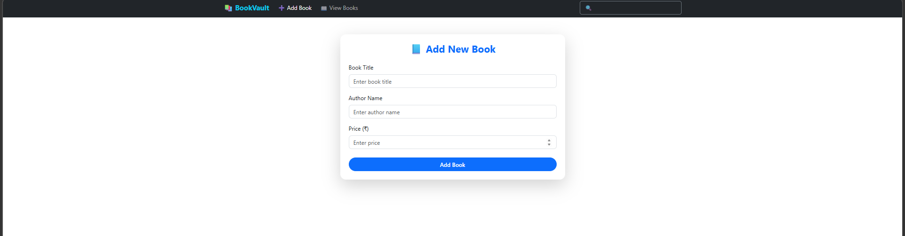
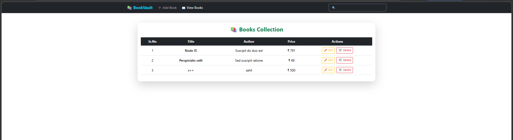

# Book Management System

This is a React-based web application for managing a collection of books. Users can add, view, edit, and delete books stored in Firebase Firestore.

## Features

- **Add Books**: Add new books with title, author, and price.
- **View Books**: Display all books in a responsive table format.
- **Edit Books**: Update existing book details.
- **Delete Books**: Remove books from the collection.
- **Responsive Design**: Built with Bootstrap for a mobile-friendly interface.

## Technologies Used

- **React**: Frontend library for building user interfaces.
- **Vite**: Build tool for fast development and bundling.
- **Firebase Firestore**: NoSQL database for storing book data.
- **Bootstrap**: CSS framework for styling.
- **React Router DOM**: For client-side routing.
- **dotenv**: For managing environment variables.

## Usage

- Navigate to the "Add Book" page to add new books.
- View all books on the "View Books" page.
- Use the edit and delete buttons to manage existing books.

## output 

 